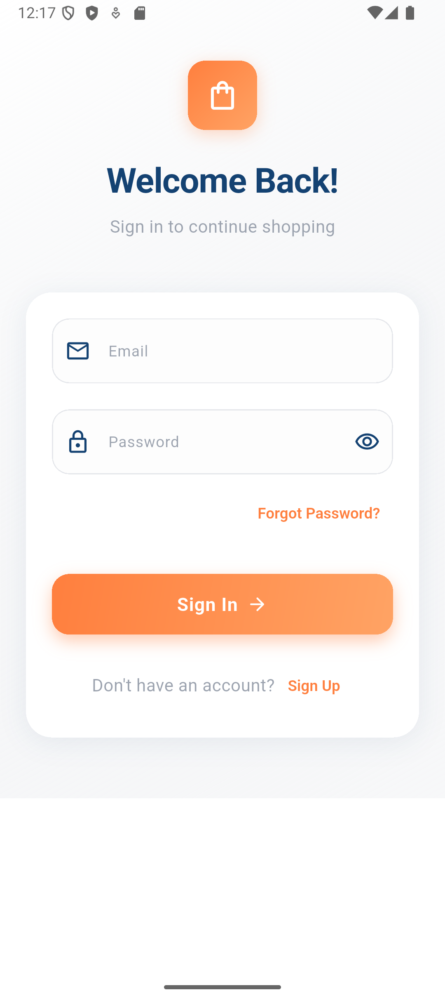
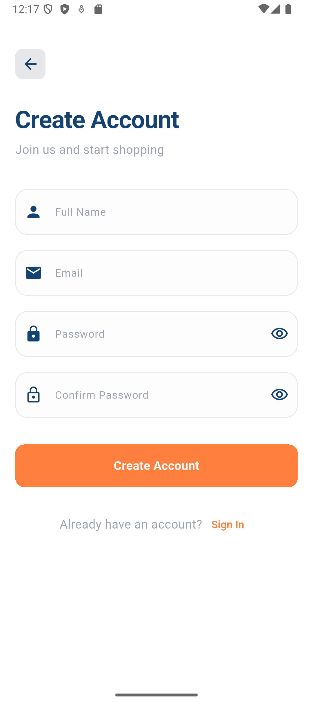
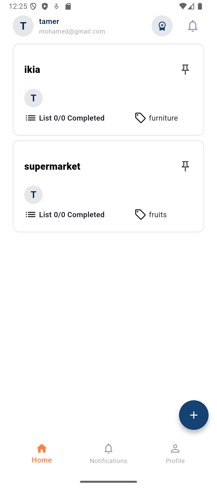
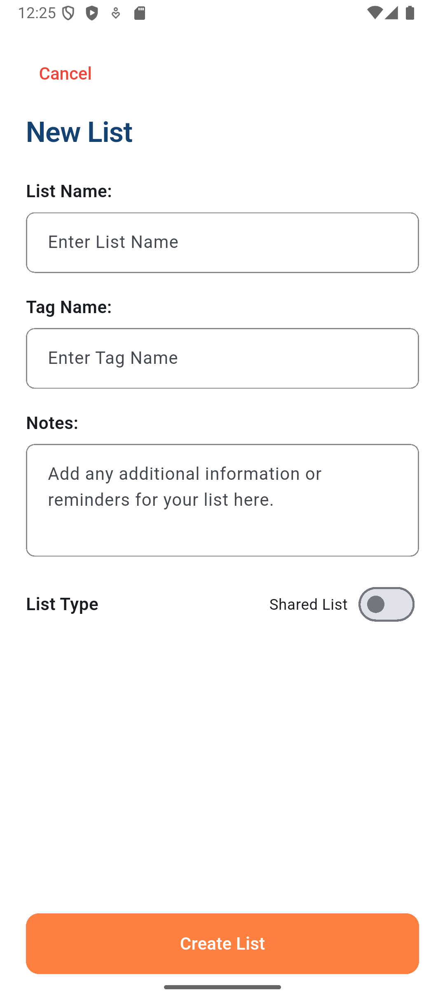
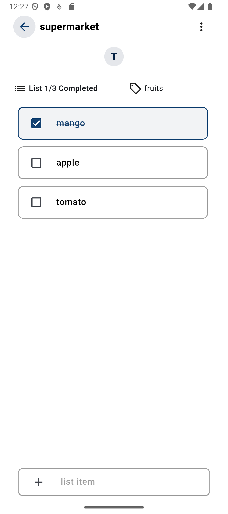
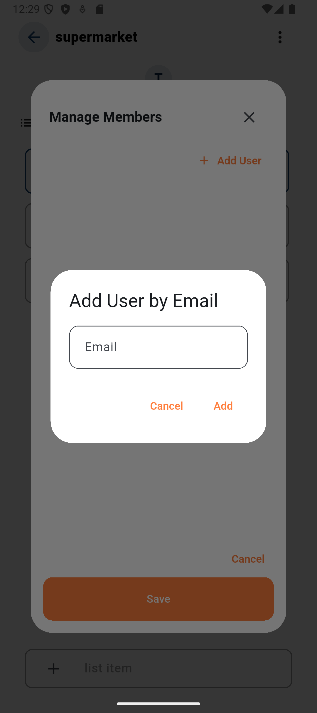
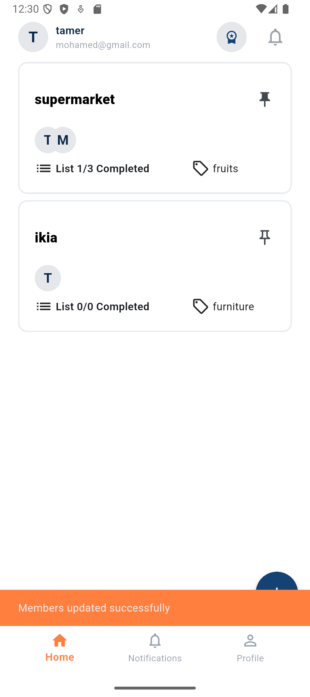

# 🛒 Collaborative Shopping List App

_A real-time shared shopping experience built with Flutter & Firebase._

## 📸 Screenshots


### 🔐 Authentication

Login Sign Up

---

 

### 🏠 Home & Lists

Home Page Create List

---

 

### 📝 Items

List View Add Item



---

### 👥 Collaboration

Invite People Shared List Example

---

 

### 👤 Profile

Profile Page

---


---

# 🚀 Overview

The **Collaborative Shopping List App** allows users to share shopping
lists with friends or family, enabling everyone to add, edit, and check
off items in real-time.

Perfect for groceries, shared houses, events, and team tasks.

---

# ✨ Features

### 🔐 Authentication

- Email & password sign-up\
- Secure login with Firebase Auth\
- Auto-login if user was previously authenticated

### 🏠 Shopping Lists

- View all personal and shared lists\
- Create unlimited lists\
- Delete or rename lists

### 📝 Items

- Add, update, check, and delete items\
- Real-time syncing using Firestore\
- Color indicators for completed items

### 👥 Collaboration

- Invite people by email\
- Lists update instantly for all members\
- Manage list members

### 👤 Profile

- View and update profile\
- Change profile picture\
- Logout functionality

---

# 🧰 Tech Stack

Area Technology

---

Framework Flutter (3.35.5)
Language Dart (3.9.2 )
Backend Firebase Auth + Firestore
Storage Firebase Storage
State Management Bloc
Platform Support Android & iOS

---

# 📂 Project Structure

    lib/
    │
    ├── core/
    │   ├── services/
    │   ├── utils/
    │   └── widgets/
    │
    ├── features/
    │   ├── auth/
    │   ├── home/
    │   ├── onboarding/
    │   ├── splash/
    │
    │
    └── main.dart

---

# 🔧 Installation & Setup

### 1️⃣ Clone the repository

```bash
git clone https://github.com/mohamed-tamerrr/collaborative-shopping-list.git
cd collaborative-shopping-list
```

### 2️⃣ Install dependencies

```bash
flutter pub get
```

### 3️⃣ Firebase Setup

- Create a Firebase project\
- Enable **Email/Password auth**\
- Create **Firestore Database**\
- Create **Storage bucket**\
- Download `google-services.json` to `/android/app/`\
- Download `GoogleService-Info.plist` to `/ios/Runner/`

### 4️⃣ Run the app

```bash
flutter run
```

---

# 🤝 Collaboration Workflow (Behind the Scenes)

1.  User creates a list → Firestore creates a document\
2.  User adds members → Their UID added to `members` array\
3.  Every member sees the list instantly\
4.  Any item update triggers real-time listeners

---

# 📌 Future Enhancements

- Offline caching\
- Item categories\
- Dark mode\
- AI suggestions

---

# 📝 License

This project is open source. Feel free to modify or contribute.
